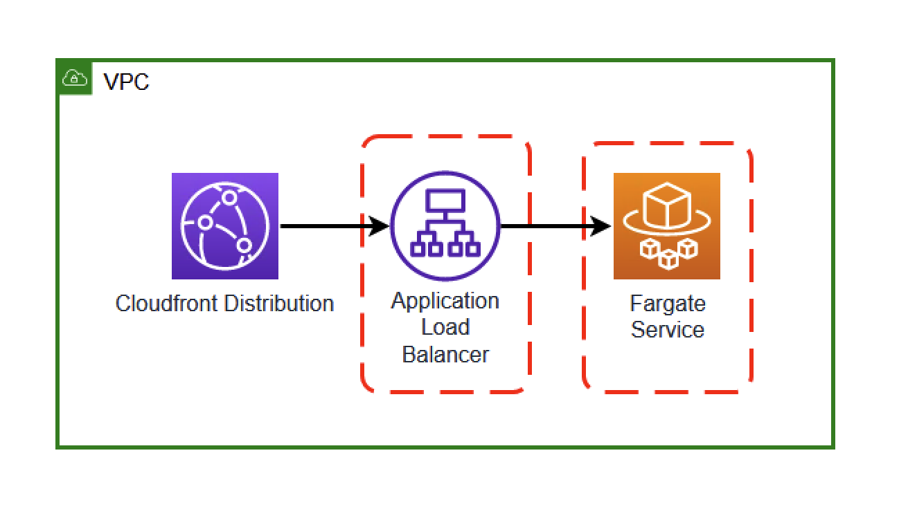
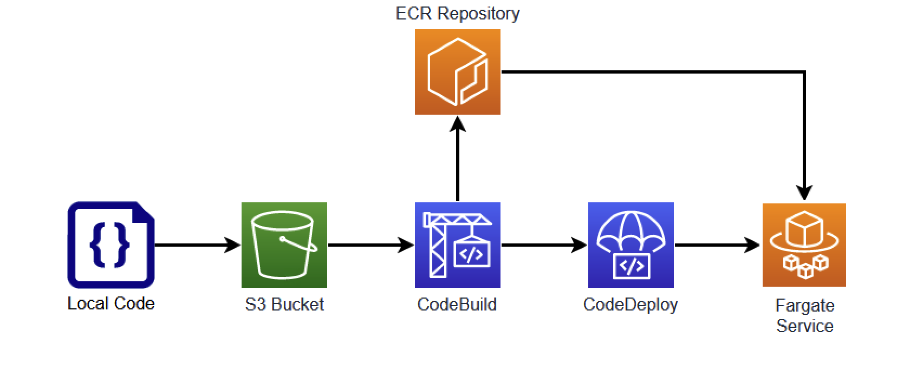

# CDK Deployment of Docker Image with CodeBuild

In many CDK deployments, a local Docker build can be done to create assets. For example, when deploying a [Python Lambda with Requirements](https://subaud.io/blog/deploying-python-lambda-with-requirements-using-cdk) you can use a [bundling](https://docs.aws.amazon.com/cdk/api/v2/docs/aws-cdk-lib.aws_s3_assets.AssetOptions.html#bundling) to install dependencies before the Function is zipped and uploaded. This can cause issues if the CPU of the machine doing the deploy is different from the [Architecture](https://docs.aws.amazon.com/cdk/api/v2/docs/aws-cdk-lib.aws_lambda.Architecture.html) of the [Function](https://docs.aws.amazon.com/cdk/api/v2/docs/aws-cdk-lib.aws_lambda.Function.html). If the CPU of the machine doing the deploy is an Intel based machine, but the Function is `ARM_64` the Function will not work. The same applies to [Fargate](https://docs.aws.amazon.com/AmazonECS/latest/userguide/what-is-fargate.html) containers. In this demo, you will see how to deploy a Fargate container without having to worry about the CPU of the deploying machine using [AWS CodeBuild](https://aws.amazon.com/codebuild/).

## Goal

In this demo, we are trying to build a CDK deployed Fargate container that is accessed through a Cloudfront Distribution and Application LoadBalancer using a custom Docker build.



In order to do this, we must build a [Docker image](https://docs.aws.amazon.com/AmazonECS/latest/userguide/create-container-image.html). We want to use an `ARM_64` cpuArchitecture for this image, but do not want to require the CDK to be deployed from a machine with an `ARM_64` CPU. Therefore, we will use CodeBuild to build the image.

## ECS Setup

The first step to deploying this image is to create the ECS infrastructure. Much of this is covered [here](https://www.subaud.io/blog/building-a-websocket-server-with-fargate-and-cdk) in more detail.

The biggest difference is that we will initialize this ECS cluster with a container that we will not be using for long.

```typescript
taskDefinition.addContainer('cdk-codebuild', {
  image: ContainerImage.fromRegistry(
    'public.ecr.aws/nginx/nginx:latest-arm64v8',
  ),
  portMappings: [{ containerPort: 80, hostPort: 80 }],
  logging: new AwsLogDriver({ streamPrefix: 'cdk-codebuild' }),
  healthCheck: {
    command: ['CMD-SHELL', 'curl -f http://localhost/'],
  },
});
```

The container that we are adding here is only a placeholder until we can build and deploy our actual image. To do this, we will use an `ARM_64` [nginx](https://gallery.ecr.aws/nginx/nginx) image. When the ECS service is created, this image will be used for the Task created.

## Building the Image



Uploading and building the image is a multi-step process that will take local code and deploy it to our Fargate Service.

### Uploading Assets

The first step to deploying this image is to upload the local `Dockerfile` and associated code.

```typescript
const bundle = new Asset(this, 'bundle', {
  path: 'src/resources/dockerExample',
});
```

This will zip the contents of the `dockerExample` directory and upload to the CDK assets bucket.

### Pipeline

In order to build the image, we will use an [AWS CodePipeline](https://aws.amazon.com/codepipeline/) with this bucket and key as the source.

```typescript
const sourceAction = new S3SourceAction({
  actionName: 'S3Source',
  bucket: bundle.bucket,
  bucketKey: bundle.s3ObjectKey,
  output: sourceOutput,
  trigger: S3Trigger.EVENTS,
});
```

Now, whenever this key is updated, the AWS CodePipeline will trigger. This pipeline is only three steps - source, build, and deploy:

```typescript
new Pipeline(this, 'docker-codebuild-pipeline', {
  stages: [
    {
      stageName: 'source',
      actions: [sourceAction],
    },
    {
      stageName: 'build',
      actions: [buildAction],
    },
    {
      stageName: 'deploy',
      actions: [deployAction],
    },
  ],
});
```

### CodeBuild

The build portion of this pipeline is the most complex but can be broken down to a few key steps:

1. Using the source key (the uploaded Zip file)
2. A `docker build` command is executed
3. This image is pushed to an ECR repository
4. An `imagedefinitions.json` file is created with this information

```typescript
const project = new Project(this, 'codeBuildProject', {
  role: codeBuildRole,
  buildSpec: BuildSpec.fromObject({
    version: '0.2',
    phases: {
      pre_build: {
        commands: [
          'echo Logging in to Amazon ECR...',
          'aws ecr get-login-password --region $AWS_DEFAULT_REGION | docker login --username AWS --password-stdin $AWS_ACCOUNT_ID.dkr.ecr.$AWS_DEFAULT_REGION.amazonaws.com',
        ],
      },
      build: {
        commands: [
          'echo Build started on `date`',
          'echo Building the Docker image...',
          'docker build -t $IMAGE_REPO_NAME:$IMAGE_TAG .',
          'docker tag $IMAGE_REPO_NAME:$IMAGE_TAG $AWS_ACCOUNT_ID.dkr.ecr.$AWS_DEFAULT_REGION.amazonaws.com/$IMAGE_REPO_NAME:$IMAGE_TAG',
        ],
      },
      post_build: {
        commands: [
          'echo Build completed on `date`',
          'echo Pushing the Docker image...',
          'docker push $AWS_ACCOUNT_ID.dkr.ecr.$AWS_DEFAULT_REGION.amazonaws.com/$IMAGE_REPO_NAME:$IMAGE_TAG',
          'echo Writing image definitions file...',
          'printf \'[{"name":"cdk-codebuild","imageUri":"%s"}]\' $IMAGE_REPO_URI:$IMAGE_TAG > imagedefinitions.json',
        ],
      },
    },
    artifacts: {
      files: ['imagedefinitions.json'],
    },
  }),
  source: Source.s3({
    bucket: bundle.bucket,
    path: bundle.s3ObjectKey,
  }),
  environment: {
    buildImage: LinuxArmBuildImage.AMAZON_LINUX_2_STANDARD_3_0,
    environmentVariables: {
      AWS_DEFAULT_REGION: { value: Stack.of(this).region },
      AWS_ACCOUNT_ID: { value: Stack.of(this).account },
      IMAGE_REPO_NAME: { value: this.ecrRepository.repositoryName },
      IMAGE_REPO_URI: { value: this.ecrRepository.repositoryUri },
      IMAGE_TAG: { value: 'latest' },
    },
  },
});
```

This will use a `LinuxArmBuildImage` to create the Docker image, ensuring us that an `ARM_64` CPU will be used when the image is created regardless of the CPU of the machine doing the CDK deployment.

### Deployment

Finally, we will use this image to deploy to the Fargate service previously created.

```typescript
const deployAction = new EcsDeployAction({
  actionName: 'Deploy',
  service: props.fargateService,
  input: buildOutput,
});
```

The `public.ecr.aws/nginx/nginx:latest-arm64v8` image that was originally used will be replaced with the newly built image that has been uploaded to an ECR repository.

## Caveats

In a deployment like this, the CodePipeline will only be triggered when the source code for the Docker image is changed. If you need to rebuild the image for any reason, you will need to manually run the CodePipeline.

# Testing

To test this for yourself, simply clone this repo and deploy the CDK:

```bash
git clone git@github.com:schuettc/cdk-docker-codebuild.git
cd cdk-docker-codebuild
yarn launch
```

# Cleanup

To remove these resources:

```bash
yarn cdk destroy
```
